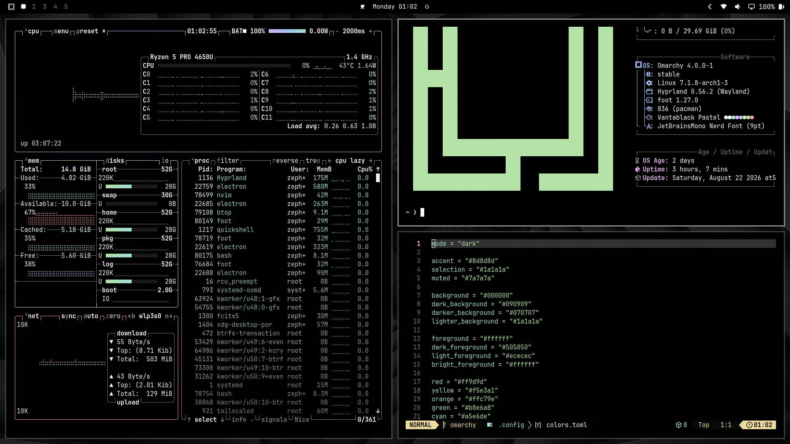

# dotfiles

Personal config sync for [Omarchy](https://omarchy.org) (Arch + Hyprland).



## Restore (quick reference)

**Restore configs** — pull your tracked changes onto a machine where the repo is
already attached:

```bash
cd ~/.config && git fetch origin && git reset --hard origin/omarchy && omarchy restart shell
```

**Restore the boot/login screen** (plymouth + SDDM) — reapply the customized
themes to `/usr/share` and rebuild the initramfs:

```bash
sudo ~/.config/omarchy/scripts/sync-plymouth
```

Full first-time setup and per-app instructions are below.

## Branches

| Branch | Contents |
|--------|----------|
| `omarchy` | Active Omarchy visual setup (main) |
| `mint` | Archived Linux Mint + i3 setup |

## What's backed up

This repo stores **only your changes on top of a stock Omarchy install** — not a
copy of Omarchy itself. A fresh install seeds `~/.config` with its defaults from
`/etc/skel`; this repo carries just the files you customized, so pulling it
reproduces this device's setup.

**Tracked:**

- `hypr/input.lua`, `hypr/looknfeel.lua` — window-manager tweaks (gaps, blur,
  touchpad, gestures)
- `omarchy/shell.json` — bar layout (clock, weather, network, power)
- `omarchy/firefox/` — square + frosted-glass static theme
- `omarchy/packages/` — app add/remove manifest
- `omarchy/scripts/` — `sync-apps`, `sync-plymouth`, `vesktop-theme-sync`
- `omarchy/hooks/` — custom hooks (voxtype, agent, fingerprint, vesktop)
- `omarchy/plugins/zephyr.network/` — custom bar network module
- `omarchy/sddm/`, `omarchy/plymouth/` — boot/login theme backups
- `omarchy/branding/`, `omarchy/defaults/agent`
- `omarchy/themes/vantablack-pastel/` — custom theme (fork of stock `vantablack`)
- `vesktop/settings/` — hand-authored Vencord config
- `README.md`, `.gitignore`, `screenshots/`

**Excluded:** stock-identical files Omarchy re-seeds (`alacritty`, `foot`,
`kitty`, `ghostty`, stock `hypr`/`omarchy` files) and everything personal —
browser profiles, app state, secrets, `hypr/monitors.lua`.

## New-device setup (first time)

A fresh install already has `~/.config` with stock defaults, so graft the repo
onto it rather than cloning into it:

```bash
cd ~/.config
git init -b omarchy
git remote add origin https://github.com/Zephyr73/dotfiles.git
git fetch origin
git reset --hard origin/omarchy   # overlays your tracked changes; stock files stay as stock
git branch -u origin/omarchy      # so future updates are just `git pull`
```

After the reset, run the machine-specific steps:

```bash
omarchy refresh config hypr/monitors.lua   # only if the file is missing
omarchy restart shell
```

Browser theming and the boot/login themes need a manual re-apply — see below.

## Manual per-app re-apply

### Firefox

Copy the static theme into the active profile:

```bash
cp ~/.config/omarchy/firefox/base.userChrome.css  ~/.config/mozilla/firefox/*.default-release/chrome/userChrome.css
cp ~/.config/omarchy/firefox/base.userContent.css ~/.config/mozilla/firefox/*.default-release/chrome/userContent.css
```

Requires in `user.js`: `toolkit.legacyUserProfileCustomizations.stylesheets = true`
and `widget.wayland.opaque-region.enabled = false`. Firefox must use the
**System theme** (`extensions.activeThemeID = "default-theme@mozilla.org"`) — the
built-in Dark theme repaints the chrome over the CSS and breaks the glass colors.

### Apps (packages)

```bash
~/.config/omarchy/scripts/sync-apps                # add/remove per manifest
~/.config/omarchy/scripts/sync-apps --dry-run      # preview only
```

AUR packages (`vesktop-bin`, `visual-studio-code-bin`) are routed through
`omarchy pkg aur add` automatically.

### Boot / login screen (plymouth + SDDM)

The customized themes live in `/usr/share`, so a stock `omarchy update` overwrites
them. The repo backs them up in `omarchy/plymouth/` and `omarchy/sddm/`. Restore
after an update reports them or on a fresh install:

```bash
sudo ~/.config/omarchy/scripts/sync-plymouth
```

## Keeping machines in sync

```bash
cd ~/.config
git add -A && git commit -m "update" && git push   # save changes
git pull                                            # pull changes on another machine
```